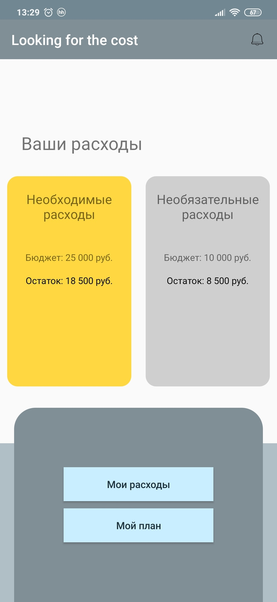
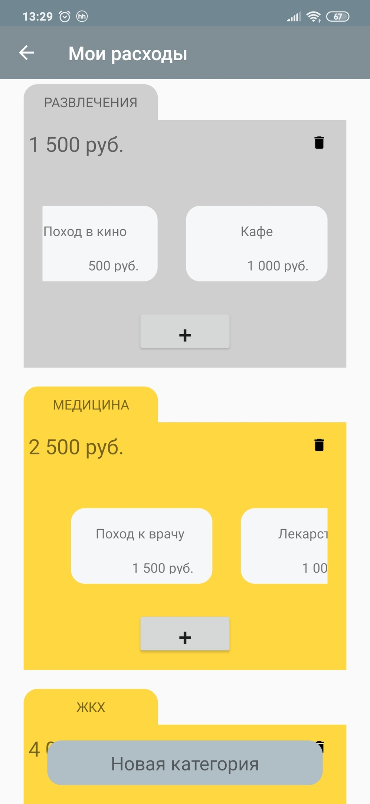
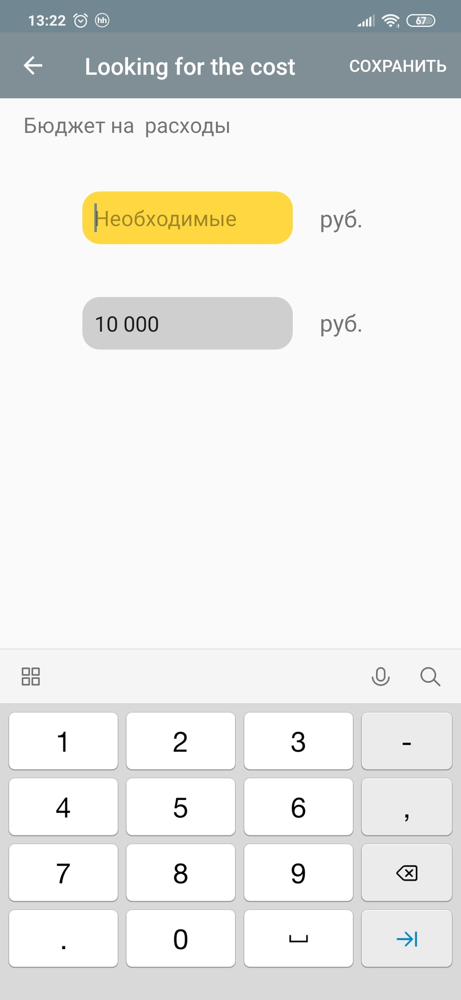
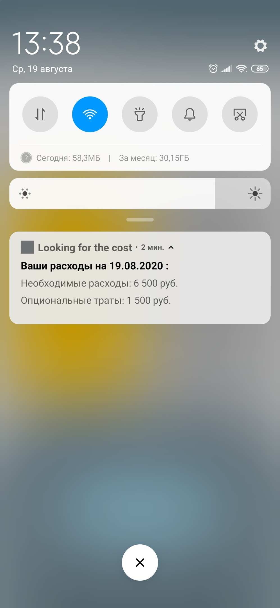

# Looking-for-the-cost
Приложение помогает вести учет доходов и расходов, с возможностью деления их на категории: необходимые и   опциональные/необязательные расходы, с учетом поставленного плана,
а также ежедневно уведомляет пользователя о   расходах по категориям  за день.

<b>Что я использовал при разработке:</b>
<ul>
<li>Room</li>
<li>Dagger2</li>
<li>lifeCycle</li>
<li>ViewModel</li>
<li>LiveData</li>
<li>RecyclerView</li>
</ul>

Мой выбор обусловлен желанием поработать на практике с новыми для меня технологиями. 

<b>Структура проекта:</b>
<ul>
<li>Пакет database</li>
Пакет dao - для хранения dao 
Пакет entity - для хранения entity. В " сущностях " реализован Parcel  для возможности передавать их через Intent. 
Пакет di - для реализации Dagger 2. 

<li>Пакет notification</li>
Класс AlarmMenegerCenter. Служит для установки AlarmMeneger. В нем есть два публичных метода: 
Метод launchNotifications(Context context). Создает и устанавливает AlarmMeneger в зависимости от заданного статуса. 
Метод getCalendar(Context context). Создает и возвращает объект Calendar с учетом времени, которое сохранено при выборе пользователем в SharedPreferences. 

Класс AlarmMenegerStatus. Его методы служат для возможности получения, установки статуса и времени AlarmMeneger 

Класс NotificationReceiver. Приемник, который запускает AlarmMeneger и запрашивает расходы по категориям. 

<li>Пакет screens</li>
В пакете находятся экраны приложения, вспомогательный класс TransferActivity для передачи Activity сущностей и два пакета:
<ul>
<li>Пакет controler:</li>
ColorController - класс содержит в себе методы, которые изменяют цвета view, в зависимости от полученных данных 

TextController - класс содержит методы, которые форматируют строки и поля ввода, в которых попадает сумма, введённая пользователем ( 1000 в 1 000,10000 в 10 000 и т.д)

<li>Пакет expenses. В нем находятся экраны вывода, создания категорий и расходов, а также пакет adapters, содержащий в себе два адаптера</li>

AdapterListCategory - для RecyclerView, созданный для отображения категорий

AdapterListExpenses - для RecyclerView, созданный для отображения в категориях списка расходов

</ul>
<li>Пакет value_expenses c единственным классом ValueExpenses, который содержит в себе методы, позволяющие выполнять математические операции.</li>
<li>Пакет MainViewModel:</li>

Класс DataBaseRequest, для асинхронных операций с данными 

MainViewModel – для связки данных 

ModelFactory – фабрика для получения возможности передачи объектов в конструктор MainViewModel 

<li>Глобальный класс App, где происходит создание компонента </li>
<li>Глобальный класс DataToday, который позволяет получать сегодняшнюю дату в определенном формате</li>
</ul>

